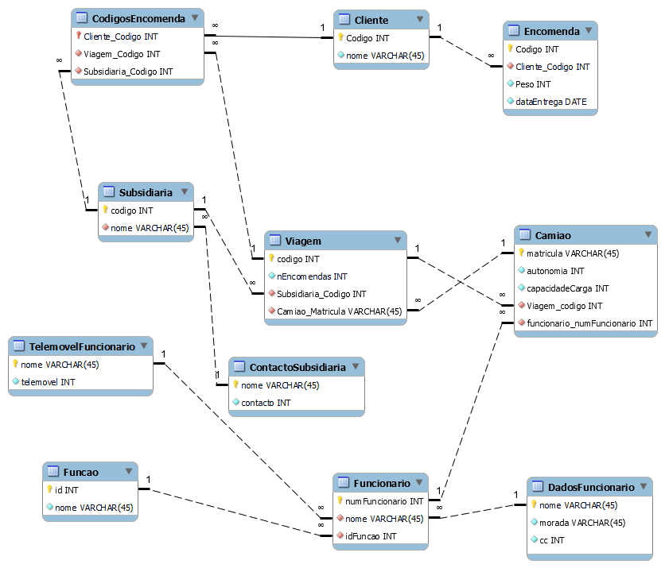

# C4 : Esquema Relacional  <!-- omit in toc -->
 

## Descrição das tabelas:

Encomenda - Informação sobre as encomendas, com acesso a códigos dos clientes.

Cliente - Informação sobre o cliente.

CodigosEncomenda - Todos os códigos.

Subsidiaria - Informação sobre as subsidiarias.

ContactoSubsidiaria - Todos os contactos das subsidiárias.

Viagem - Infomação sobre as viagens, com acesso ao destino e a qual camião está associada a viagem.

Camiao - Informação sobre os camiões, associado à viagem e determinado a um funcionario.

Funcionario - Infomações sobre o funcionário.

TelemovelFuncionario - Todos os numeros de telemóvel dos funcionários.

DadosFuncionario - Informações aprofundadas sobre o funcionário, que não estão diretamente relacionadas com a empresa.

Funcao - Qual o cargo de cada funcionário.

## Vistas

Não tem.

---
| [< Previous](rebd03.md) | [^ Main](https://github.com/SIBD08/SIBD08-Atlas/) | [Next >](rebd05.md) |
| :---------------------- | :------------------------------------------------------: | ------------------: |
