# C5 : SQL

## DDL


```sql

-- MySQL Script generated by MySQL Workbench
-- Mon Jun 20 16:36:48 2022
-- Model: New Model    Version: 1.0
-- MySQL Workbench Forward Engineering

SET @OLD_UNIQUE_CHECKS=@@UNIQUE_CHECKS, UNIQUE_CHECKS=0;
SET @OLD_FOREIGN_KEY_CHECKS=@@FOREIGN_KEY_CHECKS, FOREIGN_KEY_CHECKS=0;
SET @OLD_SQL_MODE=@@SQL_MODE, SQL_MODE='ONLY_FULL_GROUP_BY,STRICT_TRANS_TABLES,NO_ZERO_IN_DATE,NO_ZERO_DATE,ERROR_FOR_DIVISION_BY_ZERO,NO_ENGINE_SUBSTITUTION';

-- -----------------------------------------------------
-- Schema Atlas
-- -----------------------------------------------------

-- -----------------------------------------------------
-- Schema Atlas
-- -----------------------------------------------------
CREATE SCHEMA IF NOT EXISTS `Atlas` DEFAULT CHARACTER SET utf8 ;
USE `Atlas` ;

-- -----------------------------------------------------
-- Table `Atlas`.`Cliente`
-- -----------------------------------------------------
CREATE TABLE IF NOT EXISTS `Atlas`.`Cliente` (
  `Codigo` INT NOT NULL AUTO_INCREMENT,
  `nome` VARCHAR(45) NOT NULL,
  PRIMARY KEY (`Codigo`))
ENGINE = InnoDB;


-- -----------------------------------------------------
-- Table `Atlas`.`Encomenda`
-- -----------------------------------------------------
CREATE TABLE IF NOT EXISTS `Atlas`.`Encomenda` (
  `Codigo` INT NOT NULL AUTO_INCREMENT,
  `Cliente_Codigo` INT NOT NULL,
  `Peso` INT NOT NULL,
  `dataEntrega` DATE NOT NULL,
  PRIMARY KEY (`Codigo`),
  INDEX `fk_Encomenda_Cliente_idx` (`Cliente_Codigo` ASC) VISIBLE,
  CONSTRAINT `fk_Encomenda_Cliente`
    FOREIGN KEY (`Cliente_Codigo`)
    REFERENCES `Atlas`.`Cliente` (`Codigo`)
    ON DELETE NO ACTION
    ON UPDATE NO ACTION)
ENGINE = InnoDB;


-- -----------------------------------------------------
-- Table `Atlas`.`ContactoSubsidiaria`
-- -----------------------------------------------------
CREATE TABLE IF NOT EXISTS `Atlas`.`ContactoSubsidiaria` (
  `nome` VARCHAR(45) NOT NULL,
  `contacto` INT NOT NULL,
  PRIMARY KEY (`nome`))
ENGINE = InnoDB;


-- -----------------------------------------------------
-- Table `Atlas`.`Subsidiaria`
-- -----------------------------------------------------
CREATE TABLE IF NOT EXISTS `Atlas`.`Subsidiaria` (
  `codigo` INT NOT NULL AUTO_INCREMENT,
  `nome` VARCHAR(45) NOT NULL,
  PRIMARY KEY (`codigo`),
  INDEX `hghjk_idx` (`nome` ASC) VISIBLE,
  CONSTRAINT `nomeSub`
    FOREIGN KEY (`nome`)
    REFERENCES `Atlas`.`ContactoSubsidiaria` (`nome`)
    ON DELETE NO ACTION
    ON UPDATE NO ACTION)
ENGINE = InnoDB;


-- -----------------------------------------------------
-- Table `Atlas`.`Funcao`
-- -----------------------------------------------------
CREATE TABLE IF NOT EXISTS `Atlas`.`Funcao` (
  `id` INT NOT NULL AUTO_INCREMENT,
  `nome` VARCHAR(45) NOT NULL,
  PRIMARY KEY (`id`))
ENGINE = InnoDB;


-- -----------------------------------------------------
-- Table `Atlas`.`TelemovelFuncionario`
-- -----------------------------------------------------
CREATE TABLE IF NOT EXISTS `Atlas`.`TelemovelFuncionario` (
  `nome` VARCHAR(45) NOT NULL,
  `telemovel` INT NOT NULL,
  PRIMARY KEY (`nome`))
ENGINE = InnoDB;


-- -----------------------------------------------------
-- Table `Atlas`.`DadosFuncionario`
-- -----------------------------------------------------
CREATE TABLE IF NOT EXISTS `Atlas`.`DadosFuncionario` (
  `nome` VARCHAR(45) NOT NULL,
  `morada` VARCHAR(45) NOT NULL,
  `cc` INT NOT NULL,
  PRIMARY KEY (`nome`))
ENGINE = InnoDB;


-- -----------------------------------------------------
-- Table `Atlas`.`Funcionario`
-- -----------------------------------------------------
CREATE TABLE IF NOT EXISTS `Atlas`.`Funcionario` (
  `numFuncionario` INT NOT NULL AUTO_INCREMENT,
  `nome` VARCHAR(45) NOT NULL,
  `idFuncao` INT NOT NULL,
  PRIMARY KEY (`numFuncionario`),
  INDEX `idFuncao_idx` (`idFuncao` ASC) VISIBLE,
  INDEX `nomeFuc_idx` (`nome` ASC) VISIBLE,
  CONSTRAINT `idFuncao`
    FOREIGN KEY (`idFuncao`)
    REFERENCES `Atlas`.`Funcao` (`id`)
    ON DELETE NO ACTION
    ON UPDATE NO ACTION,
  CONSTRAINT `nomeFuc`
    FOREIGN KEY (`nome`)
    REFERENCES `Atlas`.`TelemovelFuncionario` (`nome`)
    ON DELETE NO ACTION
    ON UPDATE NO ACTION,
  CONSTRAINT `nomeFunc`
    FOREIGN KEY (`nome`)
    REFERENCES `Atlas`.`DadosFuncionario` (`nome`)
    ON DELETE NO ACTION
    ON UPDATE NO ACTION)
ENGINE = InnoDB;


-- -----------------------------------------------------
-- Table `Atlas`.`Camiao`
-- -----------------------------------------------------
CREATE TABLE IF NOT EXISTS `Atlas`.`Camiao` (
  `matricula` VARCHAR(45) NOT NULL,
  `autonomia` INT NOT NULL,
  `capacidadeCarga` INT NOT NULL,
  `Viagem_codigo` INT NOT NULL,
  `funcionario_numFuncionario` INT NOT NULL,
  PRIMARY KEY (`matricula`),
  INDEX `funcionarioNFuncionario_idx` (`funcionario_numFuncionario` ASC) VISIBLE,
  INDEX `codViagem_idx` (`Viagem_codigo` ASC) VISIBLE,
  CONSTRAINT `funcionarioNFuncionario`
    FOREIGN KEY (`funcionario_numFuncionario`)
    REFERENCES `Atlas`.`Funcionario` (`numFuncionario`)
    ON DELETE NO ACTION
    ON UPDATE NO ACTION,
  CONSTRAINT `codViagem`
    FOREIGN KEY (`Viagem_codigo`)
    REFERENCES `Atlas`.`Viagem` (`codigo`)
    ON DELETE NO ACTION
    ON UPDATE NO ACTION)
ENGINE = InnoDB;


-- -----------------------------------------------------
-- Table `Atlas`.`Viagem`
-- -----------------------------------------------------
CREATE TABLE IF NOT EXISTS `Atlas`.`Viagem` (
  `codigo` INT NOT NULL AUTO_INCREMENT,
  `nEncomendas` INT NOT NULL,
  `Subsidiaria_Codigo` INT NOT NULL,
  `Camiao_Matricula` VARCHAR(45) NOT NULL,
  PRIMARY KEY (`codigo`),
  INDEX `codigoSubsidiaria_idx` (`Subsidiaria_Codigo` ASC) VISIBLE,
  INDEX `matriculaCamiao_idx` (`Camiao_Matricula` ASC) VISIBLE,
  CONSTRAINT `codigoSubsidiaria02`
    FOREIGN KEY (`Subsidiaria_Codigo`)
    REFERENCES `Atlas`.`Subsidiaria` (`codigo`)
    ON DELETE NO ACTION
    ON UPDATE NO ACTION,
  CONSTRAINT `matriculaCamiao`
    FOREIGN KEY (`Camiao_Matricula`)
    REFERENCES `Atlas`.`Camiao` (`matricula`)
    ON DELETE NO ACTION
    ON UPDATE NO ACTION)
ENGINE = InnoDB;


-- -----------------------------------------------------
-- Table `Atlas`.`CodigosEncomenda`
-- -----------------------------------------------------
CREATE TABLE IF NOT EXISTS `Atlas`.`CodigosEncomenda` (
  `Cliente_Codigo` INT NOT NULL,
  `Viagem_Codigo` INT NOT NULL,
  `Subsidiaria_Codigo` INT NOT NULL,
  PRIMARY KEY (`Cliente_Codigo`),
  INDEX `codigoViagem_idx` (`Viagem_Codigo` ASC) VISIBLE,
  INDEX `codigoSubsidiaria_idx` (`Subsidiaria_Codigo` ASC) VISIBLE,
  CONSTRAINT `codigoCliente`
    FOREIGN KEY (`Cliente_Codigo`)
    REFERENCES `Atlas`.`Cliente` (`Codigo`)
    ON DELETE NO ACTION
    ON UPDATE NO ACTION,
  CONSTRAINT `codigoViagem`
    FOREIGN KEY (`Viagem_Codigo`)
    REFERENCES `Atlas`.`Viagem` (`codigo`)
    ON DELETE NO ACTION
    ON UPDATE NO ACTION,
  CONSTRAINT `codigoSubsidiaria`
    FOREIGN KEY (`Subsidiaria_Codigo`)
    REFERENCES `Atlas`.`Subsidiaria` (`codigo`)
    ON DELETE NO ACTION
    ON UPDATE NO ACTION)
ENGINE = InnoDB;


SET SQL_MODE=@OLD_SQL_MODE;
SET FOREIGN_KEY_CHECKS=@OLD_FOREIGN_KEY_CHECKS;
SET UNIQUE_CHECKS=@OLD_UNIQUE_CHECKS;


```

## DML

* Camião

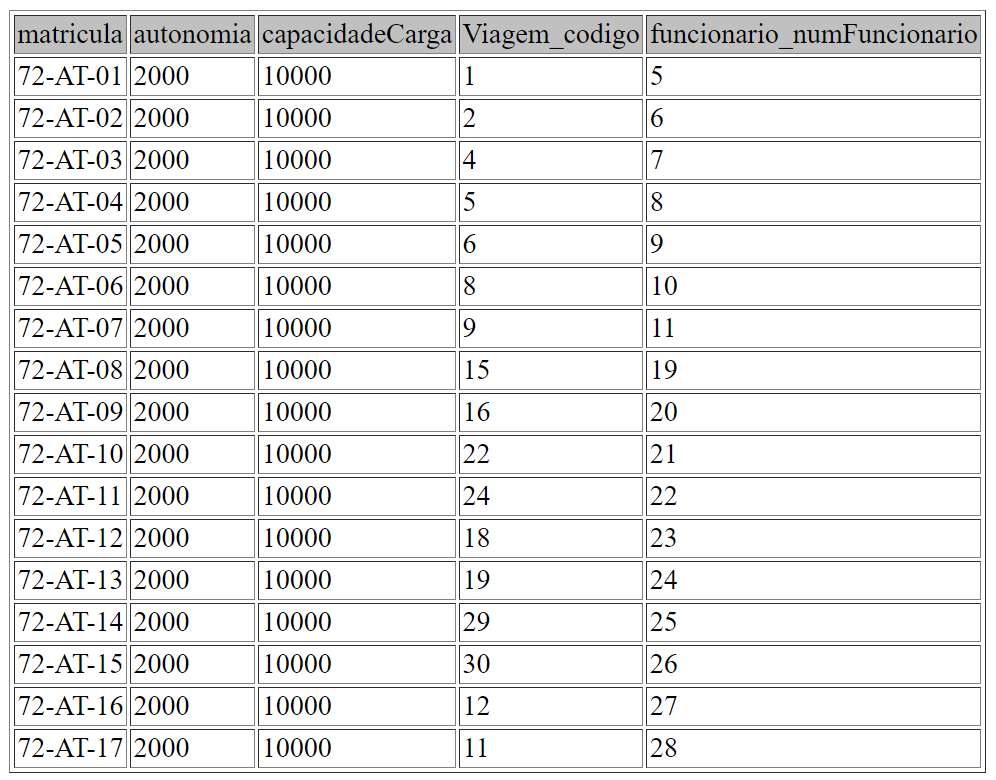

INSERT INTO `` (`matricula`,`autonomia`,`capacidadeCarga`,`Viagem_codigo`,`funcionario_numFuncionario`) VALUES ('72-AT-01',2000,10000,1,5);
INSERT INTO `` (`matricula`,`autonomia`,`capacidadeCarga`,`Viagem_codigo`,`funcionario_numFuncionario`) VALUES ('72-AT-02',2000,10000,2,6);
INSERT INTO `` (`matricula`,`autonomia`,`capacidadeCarga`,`Viagem_codigo`,`funcionario_numFuncionario`) VALUES ('72-AT-03',2000,10000,4,7);
INSERT INTO `` (`matricula`,`autonomia`,`capacidadeCarga`,`Viagem_codigo`,`funcionario_numFuncionario`) VALUES ('72-AT-04',2000,10000,5,8);
INSERT INTO `` (`matricula`,`autonomia`,`capacidadeCarga`,`Viagem_codigo`,`funcionario_numFuncionario`) VALUES ('72-AT-05',2000,10000,6,9);
INSERT INTO `` (`matricula`,`autonomia`,`capacidadeCarga`,`Viagem_codigo`,`funcionario_numFuncionario`) VALUES ('72-AT-06',2000,10000,8,10);
INSERT INTO `` (`matricula`,`autonomia`,`capacidadeCarga`,`Viagem_codigo`,`funcionario_numFuncionario`) VALUES ('72-AT-07',2000,10000,9,11);
INSERT INTO `` (`matricula`,`autonomia`,`capacidadeCarga`,`Viagem_codigo`,`funcionario_numFuncionario`) VALUES ('72-AT-08',2000,10000,15,19);
INSERT INTO `` (`matricula`,`autonomia`,`capacidadeCarga`,`Viagem_codigo`,`funcionario_numFuncionario`) VALUES ('72-AT-09',2000,10000,16,20);
INSERT INTO `` (`matricula`,`autonomia`,`capacidadeCarga`,`Viagem_codigo`,`funcionario_numFuncionario`) VALUES ('72-AT-10',2000,10000,22,21);
INSERT INTO `` (`matricula`,`autonomia`,`capacidadeCarga`,`Viagem_codigo`,`funcionario_numFuncionario`) VALUES ('72-AT-11',2000,10000,24,22);
INSERT INTO `` (`matricula`,`autonomia`,`capacidadeCarga`,`Viagem_codigo`,`funcionario_numFuncionario`) VALUES ('72-AT-12',2000,10000,18,23);
INSERT INTO `` (`matricula`,`autonomia`,`capacidadeCarga`,`Viagem_codigo`,`funcionario_numFuncionario`) VALUES ('72-AT-13',2000,10000,19,24);
INSERT INTO `` (`matricula`,`autonomia`,`capacidadeCarga`,`Viagem_codigo`,`funcionario_numFuncionario`) VALUES ('72-AT-14',2000,10000,29,25);
INSERT INTO `` (`matricula`,`autonomia`,`capacidadeCarga`,`Viagem_codigo`,`funcionario_numFuncionario`) VALUES ('72-AT-15',2000,10000,30,26);
INSERT INTO `` (`matricula`,`autonomia`,`capacidadeCarga`,`Viagem_codigo`,`funcionario_numFuncionario`) VALUES ('72-AT-16',2000,10000,12,27);
INSERT INTO `` (`matricula`,`autonomia`,`capacidadeCarga`,`Viagem_codigo`,`funcionario_numFuncionario`) VALUES ('72-AT-17',2000,10000,11,28);

* Cliente

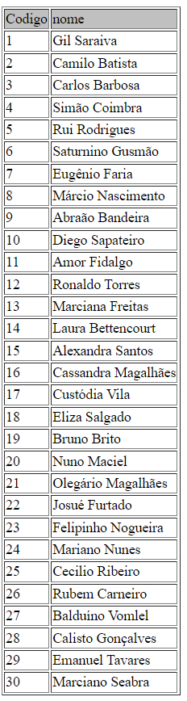

INSERT INTO  (`Codigo`,`nome`) VALUES (1,'Gil Saraiva');
INSERT INTO  (Codigo,nome) VALUES (2,'Camilo Batista');
INSERT INTO  (`Codigo`,`nome`) VALUES (3,'Carlos Barbosa');
INSERT INTO  (Codigo,nome) VALUES (4,'Simão Coimbra');
INSERT INTO  (`Codigo`,`nome`) VALUES (5,'Rui Rodrigues');
INSERT INTO  (Codigo,nome) VALUES (6,'Saturnino Gusmão');
INSERT INTO  (`Codigo`,`nome`) VALUES (7,'Eugênio Faria');
INSERT INTO  (Codigo,nome) VALUES (8,'Márcio Nascimento');
INSERT INTO  (`Codigo`,`nome`) VALUES (9,'Abraão Bandeira');
INSERT INTO  (Codigo,nome) VALUES (10,'Diego Sapateiro');
INSERT INTO  (`Codigo`,`nome`) VALUES (11,'Amor Fidalgo');
INSERT INTO  (Codigo,nome) VALUES (12,'Ronaldo Torres');
INSERT INTO  (`Codigo`,`nome`) VALUES (13,'Marciana Freitas');
INSERT INTO  (Codigo,nome) VALUES (14,'Laura Bettencourt');
INSERT INTO  (`Codigo`,`nome`) VALUES (15,'Alexandra Santos');
INSERT INTO  (Codigo,nome) VALUES (16,'Cassandra Magalhães');
INSERT INTO  (`Codigo`,`nome`) VALUES (17,'Custódia Vila');
INSERT INTO  (Codigo,nome) VALUES (18,'Eliza Salgado');
INSERT INTO  (`Codigo`,`nome`) VALUES (19,'Bruno Brito');
INSERT INTO  (Codigo,nome) VALUES (20,'Nuno Maciel');
INSERT INTO  (`Codigo`,`nome`) VALUES (21,'Olegário Magalhães');
INSERT INTO  (Codigo,nome) VALUES (22,'Josué Furtado');
INSERT INTO  (`Codigo`,`nome`) VALUES (23,'Felipinho Nogueira');
INSERT INTO  (Codigo,nome) VALUES (24,'Mariano Nunes');
INSERT INTO  (`Codigo`,`nome`) VALUES (25,'Cecilio Ribeiro');
INSERT INTO  (Codigo,nome) VALUES (26,'Rubem Carneiro');
INSERT INTO  (`Codigo`,`nome`) VALUES (27,'Balduíno Vomlel');
INSERT INTO  (Codigo,nome) VALUES (28,'Calisto Gonçalves');
INSERT INTO  (`Codigo`,`nome`) VALUES (29,'Emanuel Tavares');
INSERT INTO  (Codigo,nome) VALUES (30,'Marciano Seabra');

* CodigosEncomenda

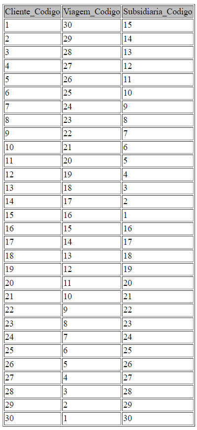

INSERT INTO `` (`Cliente_Codigo`,`Viagem_Codigo`,`Subsidiaria_Codigo`) VALUES (1,30,15);
INSERT INTO `` (`Cliente_Codigo`,`Viagem_Codigo`,`Subsidiaria_Codigo`) VALUES (2,29,14);
INSERT INTO `` (`Cliente_Codigo`,`Viagem_Codigo`,`Subsidiaria_Codigo`) VALUES (3,28,13);
INSERT INTO `` (`Cliente_Codigo`,`Viagem_Codigo`,`Subsidiaria_Codigo`) VALUES (4,27,12);
INSERT INTO `` (`Cliente_Codigo`,`Viagem_Codigo`,`Subsidiaria_Codigo`) VALUES (5,26,11);
INSERT INTO `` (`Cliente_Codigo`,`Viagem_Codigo`,`Subsidiaria_Codigo`) VALUES (6,25,10);
INSERT INTO `` (`Cliente_Codigo`,`Viagem_Codigo`,`Subsidiaria_Codigo`) VALUES (7,24,9);
INSERT INTO `` (`Cliente_Codigo`,`Viagem_Codigo`,`Subsidiaria_Codigo`) VALUES (8,23,8);
INSERT INTO `` (`Cliente_Codigo`,`Viagem_Codigo`,`Subsidiaria_Codigo`) VALUES (9,22,7);
INSERT INTO `` (`Cliente_Codigo`,`Viagem_Codigo`,`Subsidiaria_Codigo`) VALUES (10,21,6);
INSERT INTO `` (`Cliente_Codigo`,`Viagem_Codigo`,`Subsidiaria_Codigo`) VALUES (11,20,5);
INSERT INTO `` (`Cliente_Codigo`,`Viagem_Codigo`,`Subsidiaria_Codigo`) VALUES (12,19,4);
INSERT INTO `` (`Cliente_Codigo`,`Viagem_Codigo`,`Subsidiaria_Codigo`) VALUES (13,18,3);
INSERT INTO `` (`Cliente_Codigo`,`Viagem_Codigo`,`Subsidiaria_Codigo`) VALUES (14,17,2);
INSERT INTO `` (`Cliente_Codigo`,`Viagem_Codigo`,`Subsidiaria_Codigo`) VALUES (15,16,1);
INSERT INTO `` (`Cliente_Codigo`,`Viagem_Codigo`,`Subsidiaria_Codigo`) VALUES (16,15,16);
INSERT INTO `` (`Cliente_Codigo`,`Viagem_Codigo`,`Subsidiaria_Codigo`) VALUES (17,14,17);
INSERT INTO `` (`Cliente_Codigo`,`Viagem_Codigo`,`Subsidiaria_Codigo`) VALUES (18,13,18);
INSERT INTO `` (`Cliente_Codigo`,`Viagem_Codigo`,`Subsidiaria_Codigo`) VALUES (19,12,19);
INSERT INTO `` (`Cliente_Codigo`,`Viagem_Codigo`,`Subsidiaria_Codigo`) VALUES (20,11,20);
INSERT INTO `` (`Cliente_Codigo`,`Viagem_Codigo`,`Subsidiaria_Codigo`) VALUES (21,10,21);
INSERT INTO `` (`Cliente_Codigo`,`Viagem_Codigo`,`Subsidiaria_Codigo`) VALUES (22,9,22);
INSERT INTO `` (`Cliente_Codigo`,`Viagem_Codigo`,`Subsidiaria_Codigo`) VALUES (23,8,23);
INSERT INTO `` (`Cliente_Codigo`,`Viagem_Codigo`,`Subsidiaria_Codigo`) VALUES (24,7,24);
INSERT INTO `` (`Cliente_Codigo`,`Viagem_Codigo`,`Subsidiaria_Codigo`) VALUES (25,6,25);
INSERT INTO `` (`Cliente_Codigo`,`Viagem_Codigo`,`Subsidiaria_Codigo`) VALUES (26,5,26);
INSERT INTO `` (`Cliente_Codigo`,`Viagem_Codigo`,`Subsidiaria_Codigo`) VALUES (27,4,27);
INSERT INTO `` (`Cliente_Codigo`,`Viagem_Codigo`,`Subsidiaria_Codigo`) VALUES (28,3,28);
INSERT INTO `` (`Cliente_Codigo`,`Viagem_Codigo`,`Subsidiaria_Codigo`) VALUES (29,2,29);
INSERT INTO `` (`Cliente_Codigo`,`Viagem_Codigo`,`Subsidiaria_Codigo`) VALUES (30,1,30);

*ContactoSubsidiaria

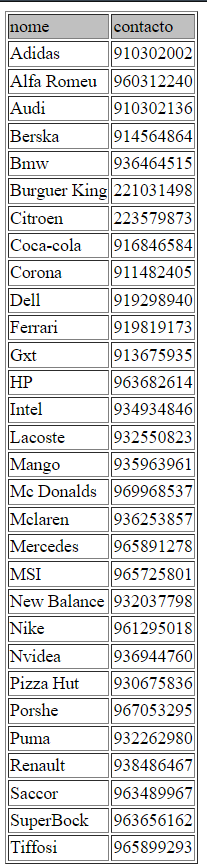

INSERT INTO  (`nome`,`contacto`) VALUES ('Adidas',910302002);
INSERT INTO  (nome,contacto) VALUES ('Alfa Romeu',960312240);
INSERT INTO  (`nome`,`contacto`) VALUES ('Audi',910302136);
INSERT INTO  (nome,contacto) VALUES ('Berska',914564864);
INSERT INTO  (`nome`,`contacto`) VALUES ('Bmw',936464515);
INSERT INTO  (nome,contacto) VALUES ('Burguer King',221031498);
INSERT INTO  (`nome`,`contacto`) VALUES ('Citroen',223579873);
INSERT INTO  (nome,contacto) VALUES ('Coca-cola',916846584);
INSERT INTO  (`nome`,`contacto`) VALUES ('Corona',911482405);
INSERT INTO  (nome,contacto) VALUES ('Dell',919298940);
INSERT INTO  (`nome`,`contacto`) VALUES ('Ferrari',919819173);
INSERT INTO  (nome,contacto) VALUES ('Gxt',913675935);
INSERT INTO  (`nome`,`contacto`) VALUES ('HP',963682614);
INSERT INTO  (nome,contacto) VALUES ('Intel',934934846);
INSERT INTO  (`nome`,`contacto`) VALUES ('Lacoste',932550823);
INSERT INTO  (nome,contacto) VALUES ('Mango',935963961);
INSERT INTO  (`nome`,`contacto`) VALUES ('Mc Donalds',969968537);
INSERT INTO  (nome,contacto) VALUES ('Mclaren',936253857);
INSERT INTO  (`nome`,`contacto`) VALUES ('Mercedes',965891278);
INSERT INTO  (nome,contacto) VALUES ('MSI',965725801);
INSERT INTO  (`nome`,`contacto`) VALUES ('New Balance',932037798);
INSERT INTO  (nome,contacto) VALUES ('Nike',961295018);
INSERT INTO  (`nome`,`contacto`) VALUES ('Nvidea',936944760);
INSERT INTO  (nome,contacto) VALUES ('Pizza Hut',930675836);
INSERT INTO  (`nome`,`contacto`) VALUES ('Porshe',967053295);
INSERT INTO  (nome,contacto) VALUES ('Puma',932262980);
INSERT INTO  (`nome`,`contacto`) VALUES ('Renault',938486467);
INSERT INTO  (nome,contacto) VALUES ('Saccor',963489967);
INSERT INTO  (`nome`,`contacto`) VALUES ('SuperBock',963656162);
INSERT INTO  (nome,contacto) VALUES ('Tiffosi',965899293);

* DadosFuncionario

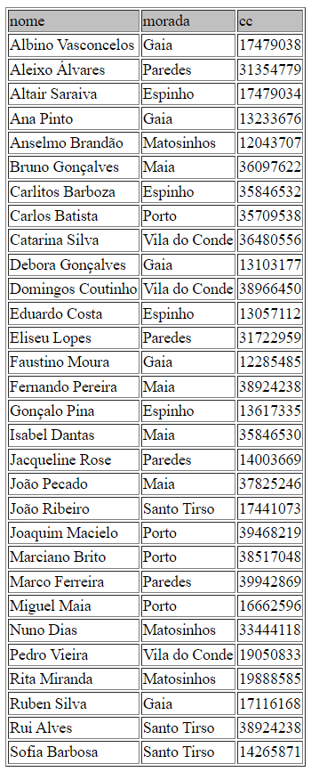

INSERT INTO `` (`nome`,`morada`,`cc`) VALUES ('Albino Vasconcelos','Gaia',17479038);
INSERT INTO `` (`nome`,`morada`,`cc`) VALUES ('Aleixo Álvares','Paredes',31354779);
INSERT INTO `` (`nome`,`morada`,`cc`) VALUES ('Altair Saraiva','Espinho',17479034);
INSERT INTO `` (`nome`,`morada`,`cc`) VALUES ('Ana Pinto','Gaia',13233676);
INSERT INTO `` (`nome`,`morada`,`cc`) VALUES ('Anselmo Brandão','Matosinhos',12043707);
INSERT INTO `` (`nome`,`morada`,`cc`) VALUES ('Bruno Gonçalves','Maia',36097622);
INSERT INTO `` (`nome`,`morada`,`cc`) VALUES ('Carlitos Barboza','Espinho',35846532);
INSERT INTO `` (`nome`,`morada`,`cc`) VALUES ('Carlos Batista','Porto',35709538);
INSERT INTO `` (`nome`,`morada`,`cc`) VALUES ('Catarina Silva','Vila do Conde',36480556);
INSERT INTO `` (`nome`,`morada`,`cc`) VALUES ('Debora Gonçalves','Gaia',13103177);
INSERT INTO `` (`nome`,`morada`,`cc`) VALUES ('Domingos Coutinho','Vila do Conde',38966450);
INSERT INTO `` (`nome`,`morada`,`cc`) VALUES ('Eduardo Costa','Espinho',13057112);
INSERT INTO `` (`nome`,`morada`,`cc`) VALUES ('Eliseu Lopes','Paredes',31722959);
INSERT INTO `` (`nome`,`morada`,`cc`) VALUES ('Faustino Moura','Gaia',12285485);
INSERT INTO `` (`nome`,`morada`,`cc`) VALUES ('Fernando Pereira','Maia',38924238);
INSERT INTO `` (`nome`,`morada`,`cc`) VALUES ('Gonçalo Pina','Espinho',13617335);
INSERT INTO `` (`nome`,`morada`,`cc`) VALUES ('Isabel Dantas','Maia',35846530);
INSERT INTO `` (`nome`,`morada`,`cc`) VALUES ('Jacqueline Rose','Paredes',14003669);
INSERT INTO `` (`nome`,`morada`,`cc`) VALUES ('João Pecado','Maia',37825246);
INSERT INTO `` (`nome`,`morada`,`cc`) VALUES ('João Ribeiro','Santo Tirso',17441073);
INSERT INTO `` (`nome`,`morada`,`cc`) VALUES ('Joaquim Macielo','Porto',39468219);
INSERT INTO `` (`nome`,`morada`,`cc`) VALUES ('Marciano Brito','Porto',38517048);
INSERT INTO `` (`nome`,`morada`,`cc`) VALUES ('Marco Ferreira','Paredes',39942869);
INSERT INTO `` (`nome`,`morada`,`cc`) VALUES ('Miguel Maia','Porto',16662596);
INSERT INTO `` (`nome`,`morada`,`cc`) VALUES ('Nuno Dias','Matosinhos',33444118);
INSERT INTO `` (`nome`,`morada`,`cc`) VALUES ('Pedro Vieira','Vila do Conde',19050833);
INSERT INTO `` (`nome`,`morada`,`cc`) VALUES ('Rita Miranda','Matosinhos',19888585);
INSERT INTO `` (`nome`,`morada`,`cc`) VALUES ('Ruben Silva','Gaia',17116168);
INSERT INTO `` (`nome`,`morada`,`cc`) VALUES ('Rui Alves','Santo Tirso',38924238);
INSERT INTO `` (`nome`,`morada`,`cc`) VALUES ('Sofia Barbosa','Santo Tirso',14265871);

* Encomenda

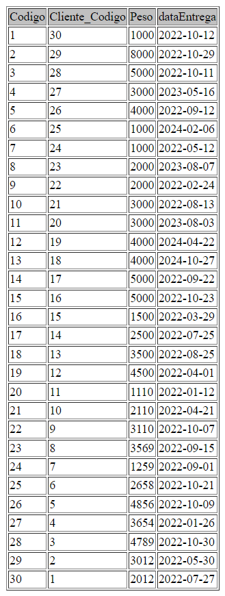

INSERT INTO `` (`Codigo`,`Cliente_Codigo`,`Peso`,`dataEntrega`) VALUES (1,30,1000,'2022-10-12');
INSERT INTO `` (`Codigo`,`Cliente_Codigo`,`Peso`,`dataEntrega`) VALUES (2,29,8000,'2022-10-29');
INSERT INTO `` (`Codigo`,`Cliente_Codigo`,`Peso`,`dataEntrega`) VALUES (3,28,5000,'2022-10-11');
INSERT INTO `` (`Codigo`,`Cliente_Codigo`,`Peso`,`dataEntrega`) VALUES (4,27,3000,'2023-05-16');
INSERT INTO `` (`Codigo`,`Cliente_Codigo`,`Peso`,`dataEntrega`) VALUES (5,26,4000,'2022-09-12');
INSERT INTO `` (`Codigo`,`Cliente_Codigo`,`Peso`,`dataEntrega`) VALUES (6,25,1000,'2024-02-06');
INSERT INTO `` (`Codigo`,`Cliente_Codigo`,`Peso`,`dataEntrega`) VALUES (7,24,1000,'2022-05-12');
INSERT INTO `` (`Codigo`,`Cliente_Codigo`,`Peso`,`dataEntrega`) VALUES (8,23,2000,'2023-08-07');
INSERT INTO `` (`Codigo`,`Cliente_Codigo`,`Peso`,`dataEntrega`) VALUES (9,22,2000,'2022-02-24');
INSERT INTO `` (`Codigo`,`Cliente_Codigo`,`Peso`,`dataEntrega`) VALUES (10,21,3000,'2022-08-13');
INSERT INTO `` (`Codigo`,`Cliente_Codigo`,`Peso`,`dataEntrega`) VALUES (11,20,3000,'2023-08-03');
INSERT INTO `` (`Codigo`,`Cliente_Codigo`,`Peso`,`dataEntrega`) VALUES (12,19,4000,'2024-04-22');
INSERT INTO `` (`Codigo`,`Cliente_Codigo`,`Peso`,`dataEntrega`) VALUES (13,18,4000,'2024-10-27');
INSERT INTO `` (`Codigo`,`Cliente_Codigo`,`Peso`,`dataEntrega`) VALUES (14,17,5000,'2022-09-22');
INSERT INTO `` (`Codigo`,`Cliente_Codigo`,`Peso`,`dataEntrega`) VALUES (15,16,5000,'2022-10-23');
INSERT INTO `` (`Codigo`,`Cliente_Codigo`,`Peso`,`dataEntrega`) VALUES (16,15,1500,'2022-03-29');
INSERT INTO `` (`Codigo`,`Cliente_Codigo`,`Peso`,`dataEntrega`) VALUES (17,14,2500,'2022-07-25');
INSERT INTO `` (`Codigo`,`Cliente_Codigo`,`Peso`,`dataEntrega`) VALUES (18,13,3500,'2022-08-25');
INSERT INTO `` (`Codigo`,`Cliente_Codigo`,`Peso`,`dataEntrega`) VALUES (19,12,4500,'2022-04-01');
INSERT INTO `` (`Codigo`,`Cliente_Codigo`,`Peso`,`dataEntrega`) VALUES (20,11,1110,'2022-01-12');
INSERT INTO `` (`Codigo`,`Cliente_Codigo`,`Peso`,`dataEntrega`) VALUES (21,10,2110,'2022-04-21');
INSERT INTO `` (`Codigo`,`Cliente_Codigo`,`Peso`,`dataEntrega`) VALUES (22,9,3110,'2022-10-07');
INSERT INTO `` (`Codigo`,`Cliente_Codigo`,`Peso`,`dataEntrega`) VALUES (23,8,3569,'2022-09-15');
INSERT INTO `` (`Codigo`,`Cliente_Codigo`,`Peso`,`dataEntrega`) VALUES (24,7,1259,'2022-09-01');
INSERT INTO `` (`Codigo`,`Cliente_Codigo`,`Peso`,`dataEntrega`) VALUES (25,6,2658,'2022-10-21');
INSERT INTO `` (`Codigo`,`Cliente_Codigo`,`Peso`,`dataEntrega`) VALUES (26,5,4856,'2022-10-09');
INSERT INTO `` (`Codigo`,`Cliente_Codigo`,`Peso`,`dataEntrega`) VALUES (27,4,3654,'2022-01-26');
INSERT INTO `` (`Codigo`,`Cliente_Codigo`,`Peso`,`dataEntrega`) VALUES (28,3,4789,'2022-10-30');
INSERT INTO `` (`Codigo`,`Cliente_Codigo`,`Peso`,`dataEntrega`) VALUES (29,2,3012,'2022-05-30');
INSERT INTO `` (`Codigo`,`Cliente_Codigo`,`Peso`,`dataEntrega`) VALUES (30,1,2012,'2022-07-27');

* Funcao

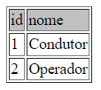

INSERT INTO  (`id`,`nome`) VALUES (1,'Condutor');
INSERT INTO  (id,nome) VALUES (2,'Operador');

* Funcionario

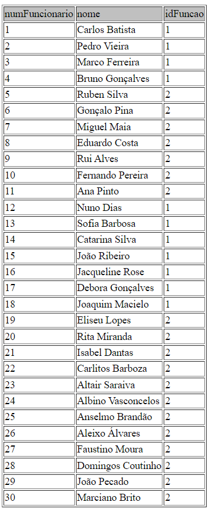

INSERT INTO `` (`numFuncionario`,`nome`,`idFuncao`) VALUES (1,'Carlos Batista',1);
INSERT INTO `` (`numFuncionario`,`nome`,`idFuncao`) VALUES (2,'Pedro Vieira',1);
INSERT INTO `` (`numFuncionario`,`nome`,`idFuncao`) VALUES (3,'Marco Ferreira',1);
INSERT INTO `` (`numFuncionario`,`nome`,`idFuncao`) VALUES (4,'Bruno Gonçalves',1);
INSERT INTO `` (`numFuncionario`,`nome`,`idFuncao`) VALUES (5,'Ruben Silva',2);
INSERT INTO `` (`numFuncionario`,`nome`,`idFuncao`) VALUES (6,'Gonçalo Pina',2);
INSERT INTO `` (`numFuncionario`,`nome`,`idFuncao`) VALUES (7,'Miguel Maia',2);
INSERT INTO `` (`numFuncionario`,`nome`,`idFuncao`) VALUES (8,'Eduardo Costa',2);
INSERT INTO `` (`numFuncionario`,`nome`,`idFuncao`) VALUES (9,'Rui Alves',2);
INSERT INTO `` (`numFuncionario`,`nome`,`idFuncao`) VALUES (10,'Fernando Pereira',2);
INSERT INTO `` (`numFuncionario`,`nome`,`idFuncao`) VALUES (11,'Ana Pinto',2);
INSERT INTO `` (`numFuncionario`,`nome`,`idFuncao`) VALUES (12,'Nuno Dias',1);
INSERT INTO `` (`numFuncionario`,`nome`,`idFuncao`) VALUES (13,'Sofia Barbosa',1);
INSERT INTO `` (`numFuncionario`,`nome`,`idFuncao`) VALUES (14,'Catarina Silva',1);
INSERT INTO `` (`numFuncionario`,`nome`,`idFuncao`) VALUES (15,'João Ribeiro',1);
INSERT INTO `` (`numFuncionario`,`nome`,`idFuncao`) VALUES (16,'Jacqueline Rose',1);
INSERT INTO `` (`numFuncionario`,`nome`,`idFuncao`) VALUES (17,'Debora Gonçalves',1);
INSERT INTO `` (`numFuncionario`,`nome`,`idFuncao`) VALUES (18,'Joaquim Macielo',1);
INSERT INTO `` (`numFuncionario`,`nome`,`idFuncao`) VALUES (19,'Eliseu Lopes',2);
INSERT INTO `` (`numFuncionario`,`nome`,`idFuncao`) VALUES (20,'Rita Miranda',2);
INSERT INTO `` (`numFuncionario`,`nome`,`idFuncao`) VALUES (21,'Isabel Dantas',2);
INSERT INTO `` (`numFuncionario`,`nome`,`idFuncao`) VALUES (22,'Carlitos Barboza',2);
INSERT INTO `` (`numFuncionario`,`nome`,`idFuncao`) VALUES (23,'Altair Saraiva',2);
INSERT INTO `` (`numFuncionario`,`nome`,`idFuncao`) VALUES (24,'Albino Vasconcelos',2);
INSERT INTO `` (`numFuncionario`,`nome`,`idFuncao`) VALUES (25,'Anselmo Brandão',2);
INSERT INTO `` (`numFuncionario`,`nome`,`idFuncao`) VALUES (26,'Aleixo Álvares',2);
INSERT INTO `` (`numFuncionario`,`nome`,`idFuncao`) VALUES (27,'Faustino Moura',2);
INSERT INTO `` (`numFuncionario`,`nome`,`idFuncao`) VALUES (28,'Domingos Coutinho',2);
INSERT INTO `` (`numFuncionario`,`nome`,`idFuncao`) VALUES (29,'João Pecado',2);
INSERT INTO `` (`numFuncionario`,`nome`,`idFuncao`) VALUES (30,'Marciano Brito',2);

* Subsidiaria

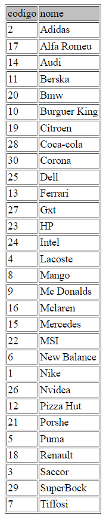

INSERT INTO  (`codigo`,`nome`) VALUES (2,'Adidas');
INSERT INTO  (codigo,nome) VALUES (17,'Alfa Romeu');
INSERT INTO  (`codigo`,`nome`) VALUES (14,'Audi');
INSERT INTO  (codigo,nome) VALUES (11,'Berska');
INSERT INTO  (`codigo`,`nome`) VALUES (20,'Bmw');
INSERT INTO  (codigo,nome) VALUES (10,'Burguer King');
INSERT INTO  (`codigo`,`nome`) VALUES (19,'Citroen');
INSERT INTO  (codigo,nome) VALUES (28,'Coca-cola');
INSERT INTO  (`codigo`,`nome`) VALUES (30,'Corona');
INSERT INTO  (codigo,nome) VALUES (25,'Dell');
INSERT INTO  (`codigo`,`nome`) VALUES (13,'Ferrari');
INSERT INTO  (codigo,nome) VALUES (27,'Gxt');
INSERT INTO  (`codigo`,`nome`) VALUES (23,'HP');
INSERT INTO  (codigo,nome) VALUES (24,'Intel');
INSERT INTO  (`codigo`,`nome`) VALUES (4,'Lacoste');
INSERT INTO  (codigo,nome) VALUES (8,'Mango');
INSERT INTO  (`codigo`,`nome`) VALUES (9,'Mc Donalds');
INSERT INTO  (codigo,nome) VALUES (16,'Mclaren');
INSERT INTO  (`codigo`,`nome`) VALUES (15,'Mercedes');
INSERT INTO  (codigo,nome) VALUES (22,'MSI');
INSERT INTO  (`codigo`,`nome`) VALUES (6,'New Balance');
INSERT INTO  (codigo,nome) VALUES (1,'Nike');
INSERT INTO  (`codigo`,`nome`) VALUES (26,'Nvidea');
INSERT INTO  (codigo,nome) VALUES (12,'Pizza Hut');
INSERT INTO  (`codigo`,`nome`) VALUES (21,'Porshe');
INSERT INTO  (codigo,nome) VALUES (5,'Puma');
INSERT INTO  (`codigo`,`nome`) VALUES (18,'Renault');
INSERT INTO  (codigo,nome) VALUES (3,'Saccor');
INSERT INTO  (`codigo`,`nome`) VALUES (29,'SuperBock');
INSERT INTO  (codigo,nome) VALUES (7,'Tiffosi');

* TelemovelFuncionario

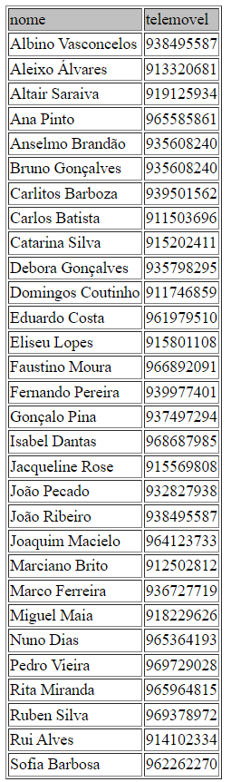

INSERT INTO `` (`nome`,`telemovel`) VALUES ('Albino Vasconcelos',938495587);
INSERT INTO `` (`nome`,`telemovel`) VALUES ('Aleixo Álvares',913320681);
INSERT INTO `` (`nome`,`telemovel`) VALUES ('Altair Saraiva',919125934);
INSERT INTO `` (`nome`,`telemovel`) VALUES ('Ana Pinto',965585861);
INSERT INTO `` (`nome`,`telemovel`) VALUES ('Anselmo Brandão',935608240);
INSERT INTO `` (`nome`,`telemovel`) VALUES ('Bruno Gonçalves',935608240);
INSERT INTO `` (`nome`,`telemovel`) VALUES ('Carlitos Barboza',939501562);
INSERT INTO `` (`nome`,`telemovel`) VALUES ('Carlos Batista',911503696);
INSERT INTO `` (`nome`,`telemovel`) VALUES ('Catarina Silva',915202411);
INSERT INTO `` (`nome`,`telemovel`) VALUES ('Debora Gonçalves',935798295);
INSERT INTO `` (`nome`,`telemovel`) VALUES ('Domingos Coutinho',911746859);
INSERT INTO `` (`nome`,`telemovel`) VALUES ('Eduardo Costa',961979510);
INSERT INTO `` (`nome`,`telemovel`) VALUES ('Eliseu Lopes',915801108);
INSERT INTO `` (`nome`,`telemovel`) VALUES ('Faustino Moura',966892091);
INSERT INTO `` (`nome`,`telemovel`) VALUES ('Fernando Pereira',939977401);
INSERT INTO `` (`nome`,`telemovel`) VALUES ('Gonçalo Pina',937497294);
INSERT INTO `` (`nome`,`telemovel`) VALUES ('Isabel Dantas',968687985);
INSERT INTO `` (`nome`,`telemovel`) VALUES ('Jacqueline Rose',915569808);
INSERT INTO `` (`nome`,`telemovel`) VALUES ('João Pecado',932827938);
INSERT INTO `` (`nome`,`telemovel`) VALUES ('João Ribeiro',938495587);
INSERT INTO `` (`nome`,`telemovel`) VALUES ('Joaquim Macielo',964123733);
INSERT INTO `` (`nome`,`telemovel`) VALUES ('Marciano Brito',912502812);
INSERT INTO `` (`nome`,`telemovel`) VALUES ('Marco Ferreira',936727719);
INSERT INTO `` (`nome`,`telemovel`) VALUES ('Miguel Maia',918229626);
INSERT INTO `` (`nome`,`telemovel`) VALUES ('Nuno Dias',965364193);
INSERT INTO `` (`nome`,`telemovel`) VALUES ('Pedro Vieira',969729028);
INSERT INTO `` (`nome`,`telemovel`) VALUES ('Rita Miranda',965964815);
INSERT INTO `` (`nome`,`telemovel`) VALUES ('Ruben Silva',969378972);
INSERT INTO `` (`nome`,`telemovel`) VALUES ('Rui Alves',914102334);
INSERT INTO `` (`nome`,`telemovel`) VALUES ('Sofia Barbosa',962262270);

* Viagem

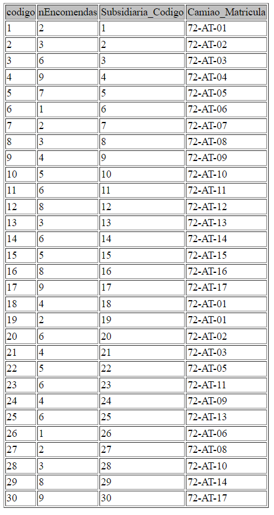

INSERT INTO `` (`codigo`,`nEncomendas`,`Subsidiaria_Codigo`,`Camiao_Matricula`) VALUES (1,2,1,'72-AT-01');
INSERT INTO `` (`codigo`,`nEncomendas`,`Subsidiaria_Codigo`,`Camiao_Matricula`) VALUES (2,3,2,'72-AT-02');
INSERT INTO `` (`codigo`,`nEncomendas`,`Subsidiaria_Codigo`,`Camiao_Matricula`) VALUES (3,6,3,'72-AT-03');
INSERT INTO `` (`codigo`,`nEncomendas`,`Subsidiaria_Codigo`,`Camiao_Matricula`) VALUES (4,9,4,'72-AT-04');
INSERT INTO `` (`codigo`,`nEncomendas`,`Subsidiaria_Codigo`,`Camiao_Matricula`) VALUES (5,7,5,'72-AT-05');
INSERT INTO `` (`codigo`,`nEncomendas`,`Subsidiaria_Codigo`,`Camiao_Matricula`) VALUES (6,1,6,'72-AT-06');
INSERT INTO `` (`codigo`,`nEncomendas`,`Subsidiaria_Codigo`,`Camiao_Matricula`) VALUES (7,2,7,'72-AT-07');
INSERT INTO `` (`codigo`,`nEncomendas`,`Subsidiaria_Codigo`,`Camiao_Matricula`) VALUES (8,3,8,'72-AT-08');
INSERT INTO `` (`codigo`,`nEncomendas`,`Subsidiaria_Codigo`,`Camiao_Matricula`) VALUES (9,4,9,'72-AT-09');
INSERT INTO `` (`codigo`,`nEncomendas`,`Subsidiaria_Codigo`,`Camiao_Matricula`) VALUES (10,5,10,'72-AT-10');
INSERT INTO `` (`codigo`,`nEncomendas`,`Subsidiaria_Codigo`,`Camiao_Matricula`) VALUES (11,6,11,'72-AT-11');
INSERT INTO `` (`codigo`,`nEncomendas`,`Subsidiaria_Codigo`,`Camiao_Matricula`) VALUES (12,8,12,'72-AT-12');
INSERT INTO `` (`codigo`,`nEncomendas`,`Subsidiaria_Codigo`,`Camiao_Matricula`) VALUES (13,3,13,'72-AT-13');
INSERT INTO `` (`codigo`,`nEncomendas`,`Subsidiaria_Codigo`,`Camiao_Matricula`) VALUES (14,6,14,'72-AT-14');
INSERT INTO `` (`codigo`,`nEncomendas`,`Subsidiaria_Codigo`,`Camiao_Matricula`) VALUES (15,5,15,'72-AT-15');
INSERT INTO `` (`codigo`,`nEncomendas`,`Subsidiaria_Codigo`,`Camiao_Matricula`) VALUES (16,8,16,'72-AT-16');
INSERT INTO `` (`codigo`,`nEncomendas`,`Subsidiaria_Codigo`,`Camiao_Matricula`) VALUES (17,9,17,'72-AT-17');
INSERT INTO `` (`codigo`,`nEncomendas`,`Subsidiaria_Codigo`,`Camiao_Matricula`) VALUES (18,4,18,'72-AT-01');
INSERT INTO `` (`codigo`,`nEncomendas`,`Subsidiaria_Codigo`,`Camiao_Matricula`) VALUES (19,2,19,'72-AT-01');
INSERT INTO `` (`codigo`,`nEncomendas`,`Subsidiaria_Codigo`,`Camiao_Matricula`) VALUES (20,6,20,'72-AT-02');
INSERT INTO `` (`codigo`,`nEncomendas`,`Subsidiaria_Codigo`,`Camiao_Matricula`) VALUES (21,4,21,'72-AT-03');
INSERT INTO `` (`codigo`,`nEncomendas`,`Subsidiaria_Codigo`,`Camiao_Matricula`) VALUES (22,5,22,'72-AT-05');
INSERT INTO `` (`codigo`,`nEncomendas`,`Subsidiaria_Codigo`,`Camiao_Matricula`) VALUES (23,6,23,'72-AT-11');
INSERT INTO `` (`codigo`,`nEncomendas`,`Subsidiaria_Codigo`,`Camiao_Matricula`) VALUES (24,4,24,'72-AT-09');
INSERT INTO `` (`codigo`,`nEncomendas`,`Subsidiaria_Codigo`,`Camiao_Matricula`) VALUES (25,6,25,'72-AT-13');
INSERT INTO `` (`codigo`,`nEncomendas`,`Subsidiaria_Codigo`,`Camiao_Matricula`) VALUES (26,1,26,'72-AT-06');
INSERT INTO `` (`codigo`,`nEncomendas`,`Subsidiaria_Codigo`,`Camiao_Matricula`) VALUES (27,2,27,'72-AT-08');
INSERT INTO `` (`codigo`,`nEncomendas`,`Subsidiaria_Codigo`,`Camiao_Matricula`) VALUES (28,3,28,'72-AT-10');
INSERT INTO `` (`codigo`,`nEncomendas`,`Subsidiaria_Codigo`,`Camiao_Matricula`) VALUES (29,8,29,'72-AT-14');
INSERT INTO `` (`codigo`,`nEncomendas`,`Subsidiaria_Codigo`,`Camiao_Matricula`) VALUES (30,9,30,'72-AT-17');


---
[< Previous](rebd04.md) | [^ Main](https://github.com/SIBD08/SIBD08-Atlas/) |
:--- | :---: | 
