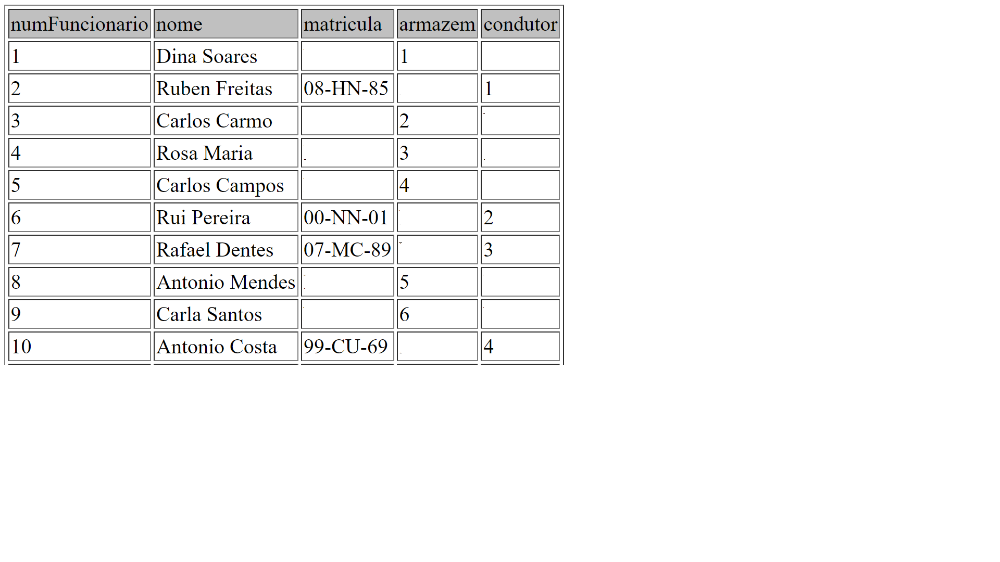

# C3 : SQL

## DDL


```sql

-- -----------------------------------------------------
-- Schema Atlas
-- -----------------------------------------------------

-- -----------------------------------------------------
-- Schema Atlas
-- -----------------------------------------------------
CREATE SCHEMA IF NOT EXISTS `Atlas` DEFAULT CHARACTER SET utf8 ;
-- -----------------------------------------------------
-- Schema atlas
-- -----------------------------------------------------
USE `Atlas` ;

-- -----------------------------------------------------
-- Table `Atlas`.`Cliente`
-- -----------------------------------------------------
CREATE TABLE IF NOT EXISTS `Atlas`.`Cliente` (
  `Codigo` INT NOT NULL,
  `nome` VARCHAR(45) NOT NULL,
  PRIMARY KEY (`Codigo`))
ENGINE = InnoDB;


-- -----------------------------------------------------
-- Table `Atlas`.`Encomenda`
-- -----------------------------------------------------
CREATE TABLE IF NOT EXISTS `Atlas`.`Encomenda` (
  `Codigo` INT NOT NULL,
  `Cliente_Codigo` INT NOT NULL,
  PRIMARY KEY (`Codigo`),
  INDEX `Cliente_Codigo_idx` (`Cliente_Codigo` ASC) VISIBLE,
  CONSTRAINT `Cliente_Codigo`
    FOREIGN KEY (`Cliente_Codigo`)
    REFERENCES `Atlas`.`Cliente` (`Codigo`)
    ON DELETE NO ACTION
    ON UPDATE NO ACTION)
ENGINE = InnoDB;


-- -----------------------------------------------------
-- Table `Atlas`.`Viagem`
-- -----------------------------------------------------
CREATE TABLE IF NOT EXISTS `Atlas`.`Viagem` (
  `codigo` INT NOT NULL,
  PRIMARY KEY (`codigo`))
ENGINE = InnoDB;


-- -----------------------------------------------------
-- Table `Atlas`.`Subsidiaria`
-- -----------------------------------------------------
CREATE TABLE IF NOT EXISTS `Atlas`.`Subsidiaria` (
  `codigo` INT NOT NULL AUTO_INCREMENT,
  `nome` VARCHAR(45) NOT NULL,
  `Viagem_Codigo` INT NOT NULL,
  PRIMARY KEY (`codigo`),
  INDEX `Viagem_Codigo_idx` (`Viagem_Codigo` ASC) VISIBLE,
  CONSTRAINT `Viagem_Codigo`
    FOREIGN KEY (`Viagem_Codigo`)
    REFERENCES `Atlas`.`Viagem` (`codigo`)
    ON DELETE NO ACTION
    ON UPDATE NO ACTION)
ENGINE = InnoDB;


-- -----------------------------------------------------
-- Table `Atlas`.`Camiao`
-- -----------------------------------------------------
CREATE TABLE IF NOT EXISTS `Atlas`.`Camiao` (
  `matricula` VARCHAR(45) NOT NULL,
  `autonomia` INT NOT NULL,
  `capacidadeCarga` INT NOT NULL,
  PRIMARY KEY (`matricula`))
ENGINE = InnoDB;


-- -----------------------------------------------------
-- Table `Atlas`.`Funcionario`
-- -----------------------------------------------------
CREATE TABLE IF NOT EXISTS `Atlas`.`Funcionario` (
  `numFuncionario` INT NOT NULL AUTO_INCREMENT,
  `nome` VARCHAR(45) NOT NULL,
  `matricula` VARCHAR(45) NOT NULL,
  `armazem` VARCHAR(45) NULL,
  `condutor` VARCHAR(45) NULL,
  PRIMARY KEY (`numFuncionario`),
  INDEX `matricula_idx` (`matricula` ASC) VISIBLE,
  CONSTRAINT `matricula`
    FOREIGN KEY (`matricula`)
    REFERENCES `Atlas`.`Camiao` (`matricula`)
    ON DELETE NO ACTION
    ON UPDATE NO ACTION)
ENGINE = InnoDB;


-- -----------------------------------------------------
-- Table `Atlas`.`Funcao`
-- -----------------------------------------------------
CREATE TABLE IF NOT EXISTS `Atlas`.`Funcao` (
  `armazem` VARCHAR(45) NULL,
  `condutor` VARCHAR(45) NULL,
  PRIMARY KEY (`armazem`, `condutor`),
  CONSTRAINT `armazemEcondutor`
    FOREIGN KEY (`armazem` , `condutor`)
    REFERENCES `Atlas`.`Funcionario` (`nome` , `nome`)
    ON DELETE NO ACTION
    ON UPDATE NO ACTION)
ENGINE = InnoDB;


-- -----------------------------------------------------
-- Table `Atlas`.`Subsidiaria_has_Encomenda`
-- -----------------------------------------------------
CREATE TABLE IF NOT EXISTS `Atlas`.`Subsidiaria_has_Encomenda` (
  `Subsidiaria_Codigo` INT NOT NULL,
  `Encomenda_Codigo` INT NOT NULL,
  PRIMARY KEY (`Subsidiaria_Codigo`, `Encomenda_Codigo`),
  INDEX `Encomenda_Codigo_idx` (`Encomenda_Codigo` ASC) VISIBLE,
  CONSTRAINT `Subsidiaria_Codigo`
    FOREIGN KEY (`Subsidiaria_Codigo`)
    REFERENCES `Atlas`.`Subsidiaria` (`codigo`)
    ON DELETE NO ACTION
    ON UPDATE NO ACTION,
  CONSTRAINT `Encomenda_Codigo`
    FOREIGN KEY (`Encomenda_Codigo`)
    REFERENCES `Atlas`.`Encomenda` (`Codigo`)
    ON DELETE NO ACTION
    ON UPDATE NO ACTION)
ENGINE = InnoDB;


-- -----------------------------------------------------
-- Table `Atlas`.`Viagem_has_Camiao`
-- -----------------------------------------------------
CREATE TABLE IF NOT EXISTS `Atlas`.`Viagem_has_Camiao` (
  `Viagem_Codigo` INT NOT NULL,
  `Camiao_Matricula` VARCHAR(45) NOT NULL,
  PRIMARY KEY (`Viagem_Codigo`, `Camiao_Matricula`),
  INDEX `Camiao_Matricula_idx` (`Camiao_Matricula` ASC) VISIBLE,
  CONSTRAINT `Viagem_Codigo`
    FOREIGN KEY (`Viagem_Codigo`)
    REFERENCES `Atlas`.`Viagem` (`codigo`)
    ON DELETE NO ACTION
    ON UPDATE NO ACTION,
  CONSTRAINT `Camiao_Matricula`
    FOREIGN KEY (`Camiao_Matricula`)
    REFERENCES `Atlas`.`Camiao` (`matricula`)
    ON DELETE NO ACTION
    ON UPDATE NO ACTION)
ENGINE = InnoDB;


SET SQL_MODE=@OLD_SQL_MODE;
SET FOREIGN_KEY_CHECKS=@OLD_FOREIGN_KEY_CHECKS;
SET UNIQUE_CHECKS=@OLD_UNIQUE_CHECKS;
```

## DML

 

* Mencione o nome do funcionário com o num Funcionário 5:

SELECT nome

FROM Funcionarios

WHERE numFuncionario= “5”

* Mencione todas as matriculas começadas por 0:


SELECT matriculas

FROM funcionarios

Where matricula=0

* Mencione os funcionários que trabalham em armazem:

SELECT nome

FROM funcionarios

WHERE armazem= "R"
---
[< Previous](rebd04.md) | [^ Main](https://github.com/SIBD08/SIBD08-Atlas/) |
:--- | :---: | 
