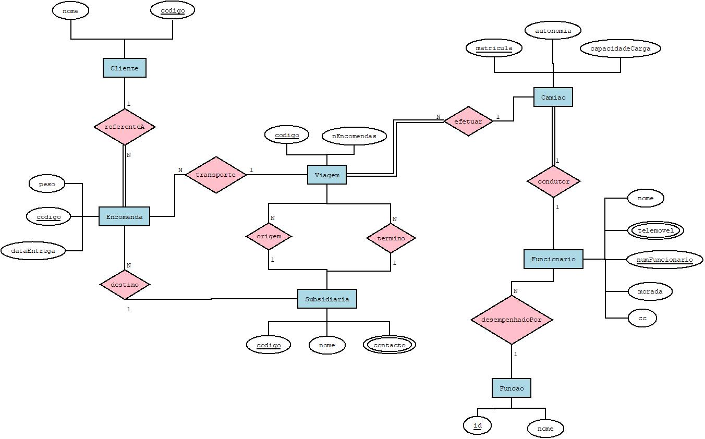

# C3 : Esquema conceptual

## Modelo E/A

ENTIDADES

* CLIENTE (_codigo, nome)
* ENCOMENDA (_codigo, peso, dataEntrega)
* SUBSIDIARIA (_codigo, nome, {contacto})
* VIAGEM (_codigo, nEncomendas)
* CAMIAO (_matricula, autonomia, capacidadeCarga)
* FUNCIONARIO (_numFuncionario, nome, {telemovel}, morada, cc)

ASSOCIAÇÔES

* referenteA (CLIENTE, ENCOMENDA) 1:N P/T
* destino (ENCOMENDA, SUBSIDIARIA) N:1 P/P
* transporte (ENCOMENDA, VIAGEM) N:1 P/P
* condutor (CAMIAO, FUNCIONARIO) 1:1 T/P
* desempenhadoPor (FUNCIONARIO, FUNCAO) N:1 P/P
* origem (SUBSIDIARIA, VIAGEM) N:1 P/P
* termino (SUBSIDIARIA, VIAGEM) N:1 P/P

 
 

## Regras de negócio adicionais (Restrições)

Para ser selecionado para condutor da nossa empresa tem de ter a carta de condução de pesados.
Pode existir troca de turnos entre funcionários do mesmo grupo, nunca um funcionário de armazém pode trocar de turno com um condutor.

---
[< Previous](rei02.md) | [^ Main](https://github.com/SIBD08/SIBD08-Atlas/) |
:--- | :---: | 
